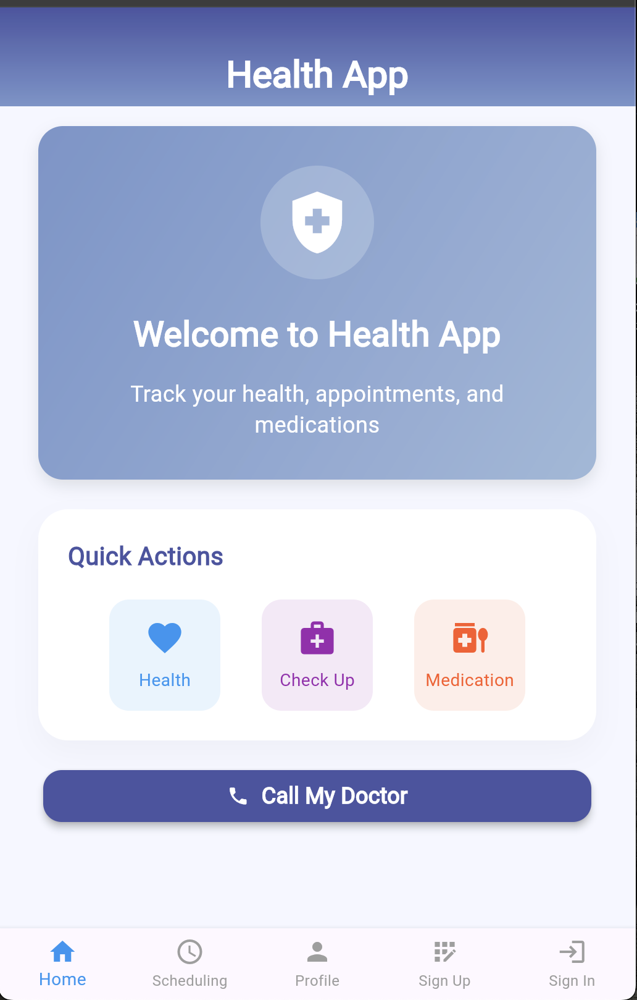

# Appointment Reminder App

A comprehensive Flutter application for managing appointments, medication reminders, and health checkups with Firebase backend integration.

## Features

- 🔐 **User Authentication** - Sign up and sign in with Firebase Auth
- 📅 **Appointment Scheduling** - Create and manage appointments with calendar integration
- 💊 **Medication Reminders** - Set up medication schedules and notifications
- 🏥 **Health Checkups** - Track and schedule health checkups
- 🔔 **Push Notifications** - Local notifications for reminders and appointments
- 👤 **User Profiles** - Personalize your experience with profile setup
- 📱 **Cross-Platform** - Works on iOS, Android, and Web

## Screenshots



*The app features a clean, modern interface with quick access to health tracking, checkups, and medication management.*

## Tech Stack

- **Frontend**: Flutter
- **Backend**: Firebase (Auth, Firestore)
- **Notifications**: Flutter Local Notifications
- **State Management**: Flutter built-in state management
- **Calendar**: Table Calendar package
- **Permissions**: Permission Handler

## Getting Started

### Prerequisites

- Flutter SDK (>=3.0.0)
- Dart SDK
- Android Studio / Xcode (for mobile development)
- Firebase project

### Installation

1. **Clone the repository**
   ```bash
   git clone https://github.com/yourusername/appointment_reminder.git
   cd appointment_reminder
   ```

2. **Install dependencies**
   ```bash
   flutter pub get
   ```

3. **Firebase Setup**
   - Create a Firebase project at [Firebase Console](https://console.firebase.google.com/)
   - Download `google-services.json` for Android and `GoogleService-Info.plist` for iOS
   - Place them in the respective platform directories
   - Update Firebase configuration in `lib/firebase_options.dart`

4. **Run the app**
   ```bash
   flutter run
   ```

## Project Structure

```
lib/
├── main.dart                 # App entry point
├── models/                   # Data models
├── pages/                    # App screens
│   ├── auth/                # Authentication pages
│   ├── home_page.dart       # Main home screen
│   ├── scheduling.dart      # Appointment scheduling
│   ├── medication_reminders.dart # Medication tracking
│   └── ProfileSetupPage.dart # User profile setup
├── services/                 # Business logic services
├── utils/                    # Utility functions
└── widgets/                  # Reusable UI components
```

## Configuration

### Firebase Configuration
- Update `lib/firebase_options.dart` with your Firebase project settings
- Ensure Firebase services (Auth, Firestore) are enabled

### Notification Permissions
- The app requests notification permissions on first launch
- Users can manage permissions in device settings


## 👨‍💻 Author

**Mohamed Hassan Jibril**
- **GitHub:** [mjibreel](https://github.com/mjibreel)
- **LinkedIn:** [moh-jibril](https://www.linkedin.com/in/moh-jibril)


